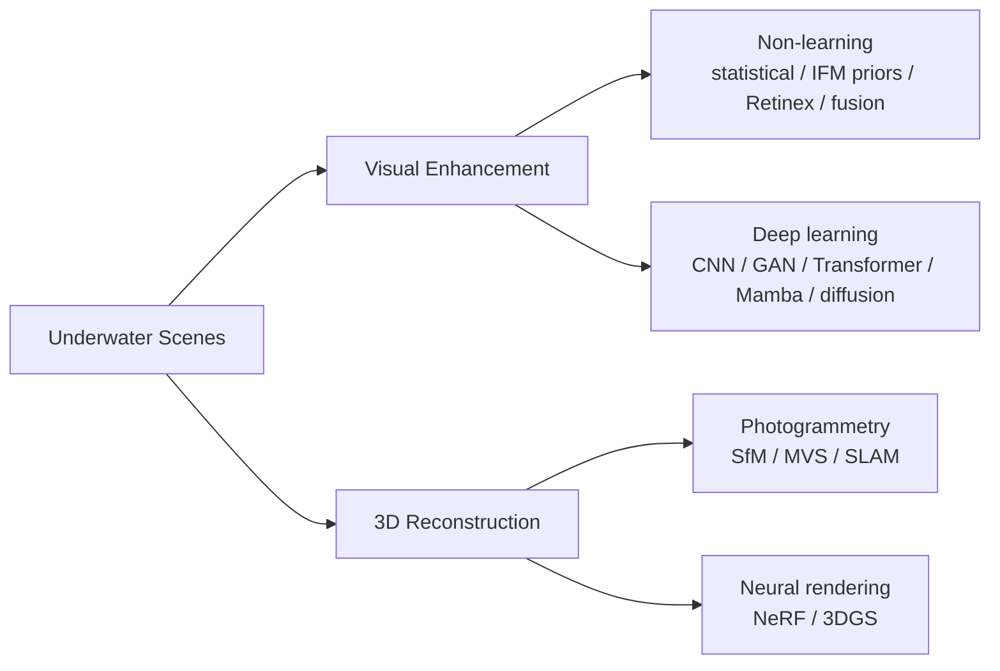

# Awesome Underwater Visual Enhancement and 3D Reconstruction [](https://awesome.re)

[](https://arxiv.org/abs/2505.01869)
[](https://doi.org/10.1007/s10462-026-11597-4)
[](CONTRIBUTING.md)
[](LICENSE)

A curated list of papers, code, and datasets on **underwater visual enhancement (UVE)** and **underwater 3D reconstruction** — from physics-based restoration to NeRF and 3D Gaussian Splatting.

This repository accompanies our survey, published (open access) in *Artificial Intelligence Review*:

> **Visual enhancement and 3D representation for underwater scenes: a review**<br>
> Guoxi Huang, Haoran Wang, Brett Seymour, Evan Kovacs, John Ellerbroc, Dave Blackham, Nantheera Anantrasirichai<br>
> *Artificial Intelligence Review*, 2026<br>
> [[Springer (Open Access)]](https://doi.org/10.1007/s10462-026-11597-4) [[arXiv]](https://arxiv.org/abs/2505.01869) [[PDF]](https://arxiv.org/pdf/2505.01869)

If you find this list or our survey useful for your research, please consider [citing our survey](#citation) and giving this repo a star :star:.

## News

- **2026-06**: Our survey is published (open access) in *Artificial Intelligence Review* — [read it here](https://doi.org/10.1007/s10462-026-11597-4).
- **2026-07**: This repository is launched. Contributions are welcome — see [CONTRIBUTING.md](CONTRIBUTING.md).

## Taxonomy

The list follows the taxonomy of our survey: enhancement operates on the image domain, while 3D reconstruction recovers scene geometry; modern neural rendering increasingly couples the two by modeling the water medium inside the 3D representation. The physical background common to both — wavelength-dependent attenuation, backscatter, and the revised underwater image formation model — is covered in Section 2 of the survey.



## Contents

- [Surveys and Reviews](#surveys-and-reviews)
- [Non-learning Enhancement and Restoration](#non-learning-enhancement-and-restoration)
- [Deep Learning-based Enhancement](#deep-learning-based-enhancement)
  - [CNN-based](#cnn-based)
  - [GAN-based](#gan-based)
  - [Transformer-based](#transformer-based)
  - [Mamba and State-Space Models](#mamba-and-state-space-models)
  - [Diffusion-based](#diffusion-based)
  - [Semi-, Weakly- and Un-supervised](#semi--weakly--and-un-supervised)
- [Underwater 3D Reconstruction](#underwater-3d-reconstruction)
  - [SfM, MVS and SLAM](#sfm-mvs-and-slam)
  - [Neural Radiance Fields](#neural-radiance-fields)
  - [3D Gaussian Splatting](#3d-gaussian-splatting)
- [Datasets and Simulators](#datasets-and-simulators)
- [Evaluation Metrics](#evaluation-metrics)
- [Related Awesome Lists](#related-awesome-lists)
- [Contributing](#contributing)
- [Citation](#citation)

## Surveys and Reviews

Prior and concurrent surveys on underwater enhancement, SLAM, and neural rendering. For a unified treatment of both enhancement *and* 3D reconstruction, see [our survey](https://doi.org/10.1007/s10462-026-11597-4).

| Year | Venue | Paper | Links | Note |
|------|-------|-------|-------|------|
| 2010 | EURASIP JASP | Underwater Image Processing: State of the Art of Restoration and Image Enhancement Methods | [Paper](https://doi.org/10.1155/2010/746052) | - |
| 2015 | Sensors | Optical Sensors and Methods for Underwater 3D Reconstruction | [Paper](https://www.mdpi.com/1424-8220/15/12/29864) | - |
| 2019 | IEEE Access | An Experimental-Based Review of Image Enhancement and Image Restoration Methods for Underwater Imaging | [Paper](https://ieeexplore.ieee.org/document/8782094/) / [Code](https://github.com/wangyanckxx/Single-Underwater-Image-Enhancement-and-Color-Restoration) | - |
| 2020 | SPIC | Diving Deeper into Underwater Image Enhancement: A Survey | [Paper](https://arxiv.org/abs/1907.07863) / [Code](https://github.com/saeed-anwar/UWSurvey) | - |
| 2022 | Computer Science Review | Visual SLAM for Underwater Vehicles: A Survey | [Paper](https://www.sciencedirect.com/science/article/abs/pii/S1574013722000442) | - |
| 2023 | Remote Sensing | An Overview of Key SLAM Technologies for Underwater Scenes | [Paper](https://www.mdpi.com/2072-4292/15/10/2496) | - |
| 2024 | arXiv | How NeRFs and 3D Gaussian Splatting are Reshaping SLAM: a Survey | [Paper](https://arxiv.org/abs/2402.13255) | - |
| 2024 | Ocean Engineering | Robust visual-based localization and mapping for underwater vehicles: A survey | [Paper](https://doi.org/10.1016/j.oceaneng.2024.119274) | - |
| 2024 | The Visual Computer | Underwater image restoration and enhancement: a comprehensive review of recent trends, challenges, and applications | [Paper](https://doi.org/10.1007/s00371-024-03630-w) | - |
| 2025 | arXiv | Underwater Image Enhancement using Generative Adversarial Networks: A Survey | [Paper](https://arxiv.org/abs/2501.06273) | GAN-UIE Survey |
| 2026 | TETCI | A Comprehensive Survey on Underwater Image Enhancement Based on Deep Learning | [Paper](https://arxiv.org/abs/2405.19684) | - |

## Non-learning Enhancement and Restoration

Statistical contrast methods, image-formation-model (IFM) priors, Retinex variants, and fusion-based approaches (Section 3 of our survey).

| Year | Venue | Paper | Links | Name |
|------|-------|-------|-------|------|
| 2007 | IAENG IJCS | Underwater Image Enhancement Using an Integrated Colour Model | [Paper](https://www.semanticscholar.org/paper/Underwater-Image-Enhancement-Using-an-Integrated-Iqbal-Salam/f5f877290a40b2bf7517405b404d348f56d7f58f) | ICM |
| 2010 | IEEE SMC | Enhancing the Low Quality Images Using Unsupervised Colour Correction Method | [Paper](https://doi.org/10.1109/ICSMC.2010.5642311) | UCM |
| 2010 | OCEANS | Initial Results in Underwater Single Image Dehazing | [Paper](https://doi.org/10.1109/OCEANS.2010.5664428) | MIP |
| 2011 | TPAMI | Single Image Haze Removal Using Dark Channel Prior | [Paper](https://doi.org/10.1109/TPAMI.2010.168) | DCP |
| 2012 | CVPR | Enhancing Underwater Images and Videos by Fusion | [Paper](https://doi.org/10.1109/CVPR.2012.6247661) | Fusion12 |
| 2013 | ICCVW | Transmission Estimation in Underwater Single Images | [Paper](https://www.cv-foundation.org/openaccess/content_iccv_workshops_2013/W24/html/Drews_Jr._Transmission_Estimation_in_2013_ICCV_paper.html) | UDCP |
| 2013 | ICCAT | Mixture Contrast Limited Adaptive Histogram Equalization for Underwater Image Enhancement | [Paper](https://doi.org/10.1109/ICCAT.2013.6522017) | Mix-CLAHE |
| 2014 | ICIP | A Retinex-Based Enhancing Approach for Single Underwater Image | [Paper](https://doi.org/10.1109/ICIP.2014.7025927) / [Project](https://xueyangfu.github.io/projects/icip2014.html) | Retinex |
| 2015 | ASOC | Underwater Image Quality Enhancement Through Integrated Color Model With Rayleigh Distribution | [Paper](https://www.sciencedirect.com/science/article/abs/pii/S1568494614005821) | Rayleigh-Stretch |
| 2015 | JVCI | Automatic Red-Channel Underwater Image Restoration | [Paper](https://www.sciencedirect.com/science/article/abs/pii/S1047320314001874) / [Code](https://github.com/agaldran/UnderWater) | RCP |
| 2017 | TIP | Underwater Image Restoration Based on Image Blurriness and Light Absorption | [Paper](https://doi.org/10.1109/TIP.2017.2663846) | IBLA |
| 2018 | TIP | Generalization of the Dark Channel Prior for Single Image Restoration | [Paper](https://doi.org/10.1109/TIP.2018.2813092) | GDCP |
| 2018 | PCM | A Rapid Scene Depth Estimation Model Based on Underwater Light Attenuation Prior for Underwater Image Restoration | [Paper](https://link.springer.com/chapter/10.1007/978-3-030-00776-8_62) / [Code](https://github.com/wangyanckxx/Single-Underwater-Image-Enhancement-and-Color-Restoration) | ULAP |
| 2018 | TIP | Color Balance and Fusion for Underwater Image Enhancement | [Paper](https://doi.org/10.1109/TIP.2017.2759252) | CBF |
| 2018 | CVPR | A Revised Underwater Image Formation Model | [Paper](https://doi.org/10.1109/CVPR.2018.00703) | Revised-UIFM |
| 2019 | CVPR | Sea-Thru: A Method for Removing Water From Underwater Images | [Paper](https://openaccess.thecvf.com/content_CVPR_2019/html/Akkaynak_Sea-Thru_A_Method_for_Removing_Water_From_Underwater_Images_CVPR_2019_paper.html) | Sea-thru |
| 2021 | TPAMI | Underwater Single Image Color Restoration Using Haze-Lines and a New Quantitative Dataset | [Paper](https://arxiv.org/abs/1811.01343) / [Code](https://github.com/danaberman/underwater-hl) | Haze-Lines |
| 2021 | EAAI | Bayesian Retinex Underwater Image Enhancement | [Paper](https://www.sciencedirect.com/science/article/abs/pii/S095219762100018X) | Bayesian-Retinex |
| 2022 | TCSVT | GUDCP: Generalization of Underwater Dark Channel Prior for Underwater Image Restoration | [Paper](https://ieeexplore.ieee.org/document/9541354/) | GUDCP |
| 2022 | TIP | Underwater Image Enhancement via Minimal Color Loss and Locally Adaptive Contrast Enhancement | [Paper](https://ieeexplore.ieee.org/document/9788535) / [Code](https://github.com/Li-Chongyi/MMLE_code) / [Project](https://li-chongyi.github.io/proj_MMLE.html) | MLLE |
| 2022 | TIP | Underwater Image Enhancement With Hyper-Laplacian Reflectance Priors | [Paper](https://ieeexplore.ieee.org/document/9854113/) / [Code](https://github.com/zhuangpeixian/HLRP) | HLRP |
| 2024 | TCSVT | Underwater Image Enhancement via Weighted Wavelet Visual Perception Fusion | [Paper](https://doi.org/10.1109/TCSVT.2023.3299314) / [Code](https://github.com/Li-Chongyi/WWPF_code) | WWPF |

## Deep Learning-based Enhancement

### CNN-based

| Year | Venue | Paper | Links | Name |
|------|-------|-------|-------|------|
| 2020 | PR | Underwater Scene Prior Inspired Deep Underwater Image and Video Enhancement | [Paper](https://www.sciencedirect.com/science/article/abs/pii/S0031320319303401) / [Code](https://github.com/saeed-anwar/UWCNN) / [Project](https://li-chongyi.github.io/proj_underwater_image_synthesis.html) | UWCNN |
| 2020 | TIP | An Underwater Image Enhancement Benchmark Dataset and Beyond | [Paper](https://arxiv.org/abs/1901.05495) / [Code](https://github.com/Li-Chongyi/DUIENet_Code) / [Project](https://li-chongyi.github.io/proj_benchmark.html) | WaterNet |
| 2020 | RSS | Simultaneous Enhancement and Super-Resolution of Underwater Imagery for Improved Visual Perception | [Paper](https://arxiv.org/abs/2002.01155) / [Code](https://github.com/xahidbuffon/Deep_SESR) | Deep SESR |
| 2021 | AAAI | Shallow-UWnet: Compressed Model for Underwater Image Enhancement | [Paper](https://arxiv.org/abs/2101.02073) / [Code](https://github.com/mkartik/Shallow-UWnet) | Shallow-UWnet |
| 2021 | ICRA | LAFFNet: A Lightweight Adaptive Feature Fusion Network for Underwater Image Enhancement | [Paper](https://arxiv.org/abs/2105.01299) | LAFFNet |
| 2021 | TIP | Underwater Image Enhancement via Medium Transmission-Guided Multi-Color Space Embedding | [Paper](https://arxiv.org/abs/2104.13015) / [Code](https://github.com/Li-Chongyi/Ucolor) / [Project](https://li-chongyi.github.io/Proj_Ucolor.html) | Ucolor |
| 2021 | SPIC | UIEC^2-Net: CNN-based Underwater Image Enhancement Using Two Color Space | [Paper](https://arxiv.org/abs/2103.07138) / [Code](https://github.com/BIGWangYuDong/UWEnhancement) | UIEC^2-Net |
| 2022 | ICASSP | Underwater Image Enhancement via Learning Water Type Desensitized Representations | [Paper](https://arxiv.org/abs/2102.00676) / [Code](https://github.com/zhenqifu/SCNet) | SCNet |
| 2022 | RA-L | Adaptive Learning Attention Network for Underwater Image Enhancement | [Paper](https://ieeexplore.ieee.org/document/9729501) / [Code](https://github.com/LiuShiBen/LANet) | LANet |
| 2022 | TIP | SGUIE-Net: Semantic Attention Guided Underwater Image Enhancement with Multi-Scale Perception | [Paper](https://arxiv.org/abs/2201.02832) / [Code](https://github.com/trentqq/SGUIE-Net_Simple) / [Project](https://trentqq.github.io/SGUIE-Net.html) | SGUIE-Net |
| 2022 | ECCV | Uncertainty Inspired Underwater Image Enhancement | [Paper](https://arxiv.org/abs/2207.09689) / [Code](https://github.com/zhenqifu/PUIE-Net) | PUIE-Net |
| 2023 | AAAI | Underwater Ranker: Learn Which Is Better and How to Be Better | [Paper](https://arxiv.org/abs/2208.06857) / [Code](https://github.com/RQ-Wu/UnderwaterRanker) / [Project](https://li-chongyi.github.io/URanker_files/) | NU2Net |
| 2023 | TCSVT | Beyond Single Reference for Training: Underwater Image Enhancement via Comparative Learning | [Paper](https://ieeexplore.ieee.org/document/9965419) / [Project](https://justwj.github.io/CLUIE-Net.html/) | CLUIE-Net |
| 2023 | TOMM | Wavelength-based Attributed Deep Neural Network for Underwater Image Restoration | [Paper](https://arxiv.org/abs/2106.07910) / [Code](https://github.com/pksvision/Deep-WaveNet-Underwater-Image-Restoration) | Deep WaveNet |
| 2023 | ICME | Transmission and Color-guided Network for Underwater Image Enhancement | [Paper](https://arxiv.org/abs/2308.04892) | ATDCnet |
| 2023 | BMVC | Five A+ Network: You Only Need 9K Parameters for Underwater Image Enhancement | [Paper](https://arxiv.org/abs/2305.08824) / [Code](https://github.com/Owen718/FiveAPlus-Network) | FiveA+ |
| 2024 | ICASSP | Toward Sufficient Spatial-Frequency Interaction for Gradient-aware Underwater Image Enhancement | [Paper](https://arxiv.org/abs/2309.04089) / [Code](https://github.com/zhihefang/SFGNet) | SFGNet |
| 2024 | WACV | PhISH-Net: Physics Inspired System for High Resolution Underwater Image Enhancement | [Paper](https://openaccess.thecvf.com/content/WACV2024/papers/Chandrasekar_PhISH-Net_Physics_Inspired_System_for_High_Resolution_Underwater_Image_Enhancement_WACV_2024_paper.pdf) / [Code](https://github.com/chandrasekaraditya/PhISH-Net) | PhISH-Net |
| 2024 | ESWA | LiteEnhanceNet: A Lightweight Network for Real-time Single Underwater Image Enhancement | [Paper](https://www.sciencedirect.com/science/article/abs/pii/S0957417423030488) | LiteEnhanceNet |
| 2025 | SMC | MAC-Lookup: Multi-Axis Conditional Lookup Model for Underwater Image Enhancement | [Paper](https://arxiv.org/abs/2507.02270) / [Code](https://github.com/onlycatdoraemon/MAC-Lookup) | MAC-Lookup |
| 2025 | arXiv | AQUA-Net: Adaptive Frequency Fusion and Illumination Aware Network for Underwater Image Enhancement | [Paper](https://arxiv.org/abs/2512.05960) | AQUA-Net |

### GAN-based

| Year | Venue | Paper | Links | Name |
|------|-------|-------|-------|------|
| 2017 | RA-L | WaterGAN: Unsupervised Generative Network to Enable Real-time Color Correction of Monocular Underwater Images | [Paper](https://arxiv.org/abs/1702.07392) / [Code](https://github.com/kskin/WaterGAN) | WaterGAN |
| 2018 | SPL | Emerging From Water: Underwater Image Color Correction Based on Weakly Supervised Color Transfer | [Paper](https://arxiv.org/abs/1710.07084) / [Project](https://li-chongyi.github.io/proj_Emerging_water.html) | UWCycleGAN |
| 2018 | ICRA | Enhancing Underwater Imagery using Generative Adversarial Networks | [Paper](https://arxiv.org/abs/1801.04011) / [Code](https://github.com/cameronfabbri/Underwater-Color-Correction) | UGAN |
| 2019 | arXiv | A Fusion Adversarial Underwater Image Enhancement Network with a Public Test Dataset | [Paper](https://arxiv.org/abs/1906.06819) | FGAN |
| 2019 | arXiv | UWGAN: Underwater GAN for Real-world Underwater Color Restoration and Dehazing | [Paper](https://arxiv.org/abs/1912.10269) / [Code](https://github.com/infrontofme/UWGAN_UIE) | UWGAN |
| 2020 | JOE | Underwater Image Enhancement Using a Multiscale Dense Generative Adversarial Network | [Paper](https://ieeexplore.ieee.org/document/8730425/) | Dense GAN |
| 2020 | RA-L | Fast Underwater Image Enhancement for Improved Visual Perception | [Paper](https://arxiv.org/abs/1903.09766) / [Code](https://github.com/xahidbuffon/FUnIE-GAN) | FUnIE-GAN |
| 2020 | GRSL | MLFcGAN: Multi-level Feature Fusion based Conditional GAN for Underwater Image Color Correction | [Paper](https://arxiv.org/abs/2002.05333) | MLFcGAN |
| 2020 | SPIC | Underwater image enhancement based on conditional generative adversarial network | [Paper](https://www.sciencedirect.com/science/article/abs/pii/S0923596519309816) | UIE-cGAN |
| 2022 | TIP | Twin Adversarial Contrastive Learning for Underwater Image Enhancement and Beyond | [Paper](https://ieeexplore.ieee.org/document/9832540/) / [Code](https://github.com/Jzy2017/TACL) | TACL |
| 2022 | TCSVT | Target Oriented Perceptual Adversarial Fusion Network for Underwater Image Enhancement | [Paper](https://ieeexplore.ieee.org/document/9774330/) / [Code](https://github.com/Jzy2017/TOPAL) | TOPAL |
| 2023 | TIP | PUGAN: Physical Model-Guided Underwater Image Enhancement Using GAN with Dual-Discriminators | [Paper](https://arxiv.org/abs/2306.08918) / [Code](https://github.com/rmcong/PUGAN_TIP2023) / [Project](https://rmcong.github.io/proj_PUGAN.html) | PUGAN |
| 2023 | TIP | HybrUR: A Hybrid Physical-Neural Solution for Unsupervised Underwater Image Restoration | [Paper](https://arxiv.org/abs/2107.02660) / [Code](https://github.com/Frankerfrank/HybrUR) | HybrUR |
| 2024 | Ecological Informatics | MuLA-GAN: Multi-Level Attention GAN for Enhanced Underwater Visibility | [Paper](https://arxiv.org/abs/2312.15633) / [Code](https://github.com/AhsanBaidar/MuLA_GAN) | MuLA-GAN |
| 2024 | PR | DGD-cGAN: A Dual Generator for Image Dewatering and Restoration | [Paper](https://arxiv.org/abs/2211.10026) | DGD-cGAN |
| 2025 | ICCIT | Underwater Image Reconstruction Using a Swin Transformer-Based Generator and PatchGAN Discriminator | [Paper](https://arxiv.org/abs/2512.05866) | SwinGAN-UIR |

### Transformer-based

| Year | Venue | Paper | Links | Name |
|------|-------|-------|-------|------|
| 2022 | ACCV | AutoEnhancer: Transformer on U-Net Architecture Search for Underwater Image Enhancement | [Paper](https://openaccess.thecvf.com/content/ACCV2022/papers/Tang_AutoEnhancer_Transformer_on_U-Net_Architecture_search_for_Underwater_Image_Enhancement_ACCV_2022_paper.pdf) / [Code](https://github.com/piggy2009/autoEnhancer) | AutoEnhancer |
| 2023 | TIP | U-shape Transformer for Underwater Image Enhancement | [Paper](https://arxiv.org/abs/2111.11843) / [Code](https://github.com/LintaoPeng/U-shape_Transformer_for_Underwater_Image_Enhancement) | U-shape Transformer |
| 2023 | Computers & Graphics | UDAformer: Underwater Image Enhancement Based on Dual Attention Transformer | [Paper](https://www.sciencedirect.com/science/article/abs/pii/S0097849323000109) | UDAformer |
| 2024 | WACV | Spectroformer: Multi-Domain Query Cascaded Transformer Network for Underwater Image Enhancement | [Paper](https://openaccess.thecvf.com/content/WACV2024/html/Khan_Spectroformer_Multi-Domain_Query_Cascaded_Transformer_Network_for_Underwater_Image_Enhancement_WACV_2024_paper.html) / [Code](https://github.com/Mdraqibkhan/Spectroformer) | Spectroformer |
| 2024 | ICASSP | X-CAUNET: Cross-Color Channel Attention with Underwater Image-Enhancing Transformer | [Paper](https://ieeexplore.ieee.org/document/10445832/) / [Code](https://github.com/Alik033/X-CAUNET) | X-CAUNet |
| 2024 | IEEE RAM | WaterFormer: A Global-Local Transformer for Underwater Image Enhancement With Environment Adaptor | [Paper](https://ieeexplore.ieee.org/document/10415308/) | WaterFormer |
| 2024 | TETCI | UIE-Convformer: Underwater Image Enhancement Based on Convolution and Feature Fusion Transformer | [Paper](https://ieeexplore.ieee.org/document/10430428/) | UIE-Convformer |
| 2024 | TCSVT | TAFormer: A Transmission-Aware Transformer for Underwater Image Enhancement | [Paper](https://ieeexplore.ieee.org/document/10669071/) | TAFormer |
| 2024 | IJCNN | UWFormer: Underwater Image Enhancement via a Semi-Supervised Multi-Scale Transformer | [Paper](https://arxiv.org/abs/2310.20210) / [Code](https://github.com/leiyingtie/UWFormer) | UWFormer |
| 2025 | WACV | Phaseformer: Phase-based Attention Mechanism for Underwater Image Restoration and Beyond | [Paper](https://arxiv.org/abs/2412.01456) / [Code](https://github.com/Mdraqibkhan/Phaseformer) | Phaseformer |
| 2025 | WACV | USWformer: Efficient Sparse Wavelet Transformer for Underwater Image Enhancement | [Paper](https://openaccess.thecvf.com/content/WACV2025/papers/Mishra_USWformer_Efficient_Sparse_Wavelet_Transformer_for_Underwater_Image_Enhancement_WACV_2025_paper.pdf) | USWformer |
| 2025 | JOE | UIE-SFIFormer: Underwater Image Enhancement Based on Physical-Guided Spatial-Frequency Interaction Transformer | [Paper](https://ieeexplore.ieee.org/document/10805568/) | UIE-SFIFormer |

### Mamba and State-Space Models

| Year | Venue | Paper | Links | Name |
|------|-------|-------|-------|------|
| 2024 | arXiv | WaterMamba: Visual State Space Model for Underwater Image Enhancement | [Paper](https://arxiv.org/abs/2405.08419) / [Code](https://github.com/Guan-MS/WaterMamba) | WaterMamba |
| 2024 | ACCV | PixMamba: Leveraging State Space Models in a Dual-Level Architecture for Underwater Image Enhancement | [Paper](https://arxiv.org/abs/2406.08444) / [Code](https://github.com/weitunglin/pixmamba) | PixMamba |
| 2024 | arXiv | Mamba-UIE: Enhancing Underwater Images with Physical Model Constraint | [Paper](https://arxiv.org/abs/2407.19248) / [Code](https://github.com/zhangsong1213/Mamba-UIE) | Mamba-UIE |
| 2024 | SPL | UWMamba: UnderWater Image Enhancement With State Space Model | [Paper](https://ieeexplore.ieee.org/document/10700679/) | UWMamba |
| 2024 | MLISE | MUIR: Mamba for Underwater Image Rendering | [Paper](https://doi.org/10.1109/MLISE62164.2024.10674249) | MUIR |
| 2025 | PRCV | O-Mamba: O-shape State-Space Model for Underwater Image Enhancement | [Paper](https://arxiv.org/abs/2408.12816) / [Code](https://github.com/chenydong/O-Mamba) | O-Mamba |
| 2026 | AAAI | Bayesian Neural Networks for One-to-Many Mapping in Image Enhancement | [Paper](https://arxiv.org/abs/2501.14265) / [Code](https://github.com/BinCVER/BEM) | BEM |
| 2026 | AAAI | PGMamba: A Physical Model-Guided Global Mamba for Underwater Image Enhancement | [Paper](https://doi.org/10.1609/aaai.v40i11.37895) | PGMamba |
| 2026 | AAAI-W | Hero-Mamba: Mamba-based Dual Domain Learning for Underwater Image Enhancement | [Paper](https://arxiv.org/abs/2604.16266) | Hero-Mamba |

### Diffusion-based

| Year | Venue | Paper | Links | Name |
|------|-------|-------|-------|------|
| 2023 | ACM MM | Underwater Image Enhancement by Transformer-based Diffusion Model with Non-uniform Sampling for Skip Strategy | [Paper](https://arxiv.org/abs/2309.03445) / [Code](https://github.com/piggy2009/DM_underwater) | UIE-DM |
| 2024 | TCSVT | Speed-Up DDPM for Real-Time Underwater Image Enhancement | [Paper](https://ieeexplore.ieee.org/document/10250851) | SU-DDPM |
| 2024 | ESWA | UIEDP: Boosting Underwater Image Enhancement with Diffusion Prior | [Paper](https://arxiv.org/abs/2312.06240) | UIEDP |
| 2024 | JSTARS | DiffWater: Underwater Image Enhancement Based on Conditional Denoising Diffusion Probabilistic Model | [Paper](https://doi.org/10.1109/JSTARS.2023.3344453) / [Code](https://github.com/Guan-MS/DiffWater) | DiffWater |
| 2024 | ECCV | Osmosis: RGBD Diffusion Prior for Underwater Image Restoration | [Paper](https://arxiv.org/abs/2403.14837) / [Code](https://github.com/osmosis-diffusion/osmosis-diffusion-code) / [Project](https://osmosis-diffusion.github.io/) | Osmosis |
| 2024 | arXiv | Image-Conditional Diffusion Transformer for Underwater Image Enhancement | [Paper](https://arxiv.org/abs/2407.05389) | ICDT |
| 2024 | arXiv | Underwater Image Enhancement with Physical-based Denoising Diffusion Implicit Models | [Paper](https://arxiv.org/abs/2409.18476) / [Code](https://github.com/bachzz/UW-DiffPhys) | UW-DiffPhys |
| 2024 | Scientific Reports | CPDM: Content-Preserving Diffusion Model for Underwater Image Enhancement | [Paper](https://www.nature.com/articles/s41598-024-82803-y) | CPDM |
| 2025 | PR | Underwater Image Enhancement by Diffusion Model with Customized CLIP-Classifier | [Paper](https://arxiv.org/abs/2405.16214) / [Code](https://github.com/OUCVisionGroup/CLIP-UIE) / [Project](https://oucvisiongroup.github.io/CLIP-UIE.html/) | CLIP-UIE |
| 2025 | Neurocomputing | BDMUIE: Underwater Image Enhancement Based on Bayesian Diffusion Model | [Paper](https://www.sciencedirect.com/science/article/abs/pii/S0925231224020459) | BDMUIE |
| 2026 | JOE | WaterDiff: Mamba-Based Latent Diffusion Model for Underwater Image Enhancement | [Paper](https://doi.org/10.1109/JOE.2026.3674692) / [Code](https://github.com/Guan-MS/WaterDiff) | WaterDiff |

### Semi-, Weakly- and Un-supervised

Methods trained without paired supervision: contrastive, mean-teacher, domain adaptation, and homology-based frameworks.

| Year | Venue | Paper | Links | Name |
|------|-------|-------|-------|------|
| 2021 | IGARSS | Single Underwater Image Restoration by Contrastive Learning | [Paper](https://arxiv.org/abs/2103.09697) / [Code](https://github.com/JunlinHan/CWR) | CWR |
| 2022 | AAAI | Unsupervised Underwater Image Restoration: From a Homology Perspective | [Paper](https://ojs.aaai.org/index.php/AAAI/article/view/19944) / [Code](https://github.com/zhenqifu/USUIR) | USUIR |
| 2023 | TIP | Domain Adaptation for Underwater Image Enhancement | [Paper](https://arxiv.org/abs/2108.09650) | TUDA |
| 2023 | CVPR | Contrastive Semi-supervised Learning for Underwater Image Restoration via Reliable Bank | [Paper](https://arxiv.org/abs/2303.09101) / [Code](https://github.com/Huang-ShiRui/Semi-UIR) | Semi-UIR |
| 2024 | IJCV | HCLR-Net: Hybrid Contrastive Learning Regularization with Locally Randomized Perturbation for Underwater Image Enhancement | [Paper](https://link.springer.com/article/10.1007/s11263-024-01987-y) / [Code](https://github.com/zhoujingchun03/HCLR-Net) | HCLR-Net |
| 2024 | TMM | Underwater Image Enhancement with Cascaded Contrastive Learning | [Paper](https://arxiv.org/abs/2411.10682) | CCL-Net |

## Underwater 3D Reconstruction

### SfM, MVS and SLAM

Photogrammetry pipelines and SLAM systems, including refraction-aware geometry for flat/dome ports (Section 4 of our survey).

| Year | Venue | Paper | Links | Name |
|------|-------|-------|-------|------|
| 2006 | IJRR | Visually Mapping the RMS Titanic: Conservative Covariance Estimates for SLAM Information Filters | [Paper](https://journals.sagepub.com/doi/abs/10.1177/0278364906072512) | Titanic-SLAM |
| 2010 | JFR | Generation and Visualization of Large-Scale Three-Dimensional Reconstructions from Underwater Robotic Surveys | [Paper](https://onlinelibrary.wiley.com/doi/abs/10.1002/rob.20324) | - |
| 2013 | ICCV | Refractive Structure-from-Motion on Underwater Images | [Paper](https://openaccess.thecvf.com/content_iccv_2013/papers/Jordt-Sedlazeck_Refractive_Structure-from-Motion_on_2013_ICCV_paper.pdf) | RSfM |
| 2016 | CVPR | Structure-from-Motion Revisited | [Paper](https://openaccess.thecvf.com/content_cvpr_2016/html/Schonberger_Structure-From-Motion_Revisited_CVPR_2016_paper.html) / [Code](https://github.com/colmap/colmap) | COLMAP |
| 2018 | IROS | SVIn2: An Underwater SLAM System using Sonar, Visual, Inertial, and Depth Sensor | [Paper](https://arxiv.org/abs/1810.03200) / [Code](https://github.com/sharminrahman/SVIn2) | SVIn2 |
| 2020 | IJCV | Refractive Two-View Reconstruction for Underwater 3D Vision | [Paper](https://link.springer.com/article/10.1007/s11263-019-01218-9) | - |
| 2022 | ISPRS JPRS | Refractive Geometry for Underwater Domes | [Paper](https://arxiv.org/abs/2108.06575) | - |
| 2023 | GCPR | Underwater Multiview Stereo Using Axial Camera Models | [Paper](https://link.springer.com/chapter/10.1007/978-3-031-54605-1_18) | - |
| 2024 | IROS | Refractive COLMAP: Refractive Structure-from-Motion Revisited | [Paper](https://arxiv.org/abs/2403.08640) / [Code](https://cau-git.rz.uni-kiel.de/inf-ag-koeser/colmap_underwater) | Refractive COLMAP |
| 2024 | JFR | Semihierarchical Reconstruction and Weak-Area Revisiting for Robotic Visual Seafloor Mapping | [Paper](https://onlinelibrary.wiley.com/doi/full/10.1002/rob.22390) | - |
| 2025 | Neural Networks | Fast Underwater Scene Reconstruction using Multi-View Stereo and Physical Imaging | [Paper](https://arxiv.org/abs/2501.11884) | - |
| 2025 | ICRA | End-to-End Underwater Multi-View Stereo for Dense Scene Reconstruction | [Paper](https://ieeexplore.ieee.org/document/11128539/) | UwMVS |
| 2025 | TRO | AQUA-SLAM: Tightly-Coupled Underwater Acoustic-Visual-Inertial SLAM with Sensor Calibration | [Paper](https://arxiv.org/abs/2503.11420) | AQUA-SLAM |
| 2026 | arXiv | WaterSplat-SLAM: Photorealistic Monocular SLAM in Underwater Environment | [Paper](https://arxiv.org/abs/2604.04642) | WaterSplat-SLAM |

### Neural Radiance Fields

NeRF methods that model the water column / participating medium inside volume rendering. Entries marked *foundation* are general-purpose bases widely used underwater.

| Year | Venue | Paper | Links | Name |
|------|-------|-------|-------|------|
| 2020 | ECCV | NeRF: Representing Scenes as Neural Radiance Fields for View Synthesis | [Paper](https://arxiv.org/abs/2003.08934) / [Code](https://github.com/bmild/nerf) / [Project](http://tancik.com/nerf) | NeRF |
| 2022 | CVPR | Mip-NeRF 360: Unbounded Anti-Aliased Neural Radiance Fields | [Paper](https://arxiv.org/abs/2111.12077) / [Code](https://github.com/google-research/multinerf) | Mip-NeRF 360 |
| 2022 | SIGGRAPH | Instant Neural Graphics Primitives with a Multiresolution Hash Encoding | [Paper](https://arxiv.org/abs/2201.05989) / [Code](https://github.com/NVlabs/instant-ngp) / [Project](https://nvlabs.github.io/instant-ngp/) | Instant-NGP |
| 2023 | CVPR | SeaThru-NeRF: Neural Radiance Fields in Scattering Media | [Paper](https://arxiv.org/abs/2304.07743) / [Code](https://github.com/deborahLevy130/seathru_NeRF) / [Project](https://sea-thru-nerf.github.io/) | SeaThru-NeRF |
| 2023 | OCEANS | WaterNeRF: Neural Radiance Fields for Underwater Scenes | [Paper](https://arxiv.org/abs/2209.13091) | WaterNeRF |
| 2023 | RA-L | Beyond NeRF Underwater: Learning Neural Reflectance Fields for True Color Correction of Marine Imagery | [Paper](https://arxiv.org/abs/2304.03384) | Beyond NeRF Underwater |
| 2023 | ICCV | ScatterNeRF: Seeing Through Fog with Physically-Based Inverse Neural Rendering | [Paper](https://arxiv.org/abs/2305.02103) | ScatterNeRF |
| 2023 | arXiv | WaterHE-NeRF: Water-ray Tracing Neural Radiance Fields for Underwater Scene Reconstruction | [Paper](https://arxiv.org/abs/2312.06946) | WaterHE-NeRF |
| 2024 | 3DV | DehazeNeRF: Multiple Image Haze Removal and 3D Shape Reconstruction using Neural Radiance Fields | [Paper](https://arxiv.org/abs/2303.11364) / [Project](https://www.computationalimaging.org/publications/dehazenerf/) | DehazeNeRF |
| 2024 | ICLR Tiny Papers | U2NeRF: Unsupervised Underwater Image Restoration and Neural Radiance Fields | [Paper](https://arxiv.org/abs/2411.16172) | U2NeRF |
| 2024 | CVPR | Neural Underwater Scene Representation | [Paper](https://openaccess.thecvf.com/content/CVPR2024/papers/Tang_Neural_Underwater_Scene_Representation_CVPR_2024_paper.pdf) | NUSR |
| 2024 | Computers & Graphics | SP-SeaNeRF: Underwater Neural Radiance Fields with Strong Scattering Perception | [Paper](https://www.sciencedirect.com/science/article/abs/pii/S0097849324001602) | SP-SeaNeRF |
| 2025 | ISCAS | AquaNeRF: Neural Radiance Fields in Underwater Media with Distractor Removal | [Paper](https://arxiv.org/abs/2502.16351) | AquaNeRF |
| 2025 | arXiv | Is-NeRF: In-scattering Neural Radiance Field for Blurred Images | [Paper](https://arxiv.org/abs/2508.13808) | Is-NeRF |
| 2025 | NeurIPS | I2-NeRF: Learning Neural Radiance Fields Under Physically-Grounded Media Interactions | [Paper](https://arxiv.org/abs/2510.22161) / [Code](https://github.com/ShuhongLL/I2-NeRF) / [Project](https://shuhongll.github.io/I2_NeRF/) | I2-NeRF |

### 3D Gaussian Splatting

3DGS methods coupling explicit Gaussian scene representations with physics-based underwater image formation.

| Year | Venue | Paper | Links | Name |
|------|-------|-------|-------|------|
| 2023 | SIGGRAPH | 3D Gaussian Splatting for Real-Time Radiance Field Rendering | [Paper](https://arxiv.org/abs/2308.04079) / [Code](https://github.com/graphdeco-inria/gaussian-splatting) / [Project](https://repo-sam.inria.fr/fungraph/3d-gaussian-splatting/) | 3DGS |
| 2024 | CVPR | Mip-Splatting: Alias-free 3D Gaussian Splatting | [Paper](https://arxiv.org/abs/2311.16493) / [Code](https://github.com/autonomousvision/mip-splatting) | Mip-Splatting |
| 2024 | CVPR | 4D Gaussian Splatting for Real-Time Dynamic Scene Rendering | [Paper](https://arxiv.org/abs/2310.08528) / [Code](https://github.com/hustvl/4DGaussians) / [Project](https://guanjunwu.github.io/4dgs/) | 4DGS |
| 2024 | arXiv | Aquatic-GS: A Hybrid 3D Representation for Underwater Scenes | [Paper](https://arxiv.org/abs/2411.00239) / [Project](https://aquaticgs.github.io/) | Aquatic-GS |
| 2024 | arXiv | Gaussian Splashing: Direct Volumetric Rendering Underwater | [Paper](https://arxiv.org/abs/2411.19588) / [Project](https://bgu-cs-vil.github.io/gaussiansplashingUW.github.io/) | Gaussian Splashing |
| 2025 | TOG | Don't Splat your Gaussians: Volumetric Ray-Traced Primitives for Modeling and Rendering Scattering and Emissive Media | [Paper](https://arxiv.org/abs/2405.15425) / [Project](https://arcanous98.github.io/projectPages/gaussianVolumes.html) | DSYG |
| 2025 | 3DV | WaterSplatting: Fast Underwater 3D Scene Reconstruction Using Gaussian Splatting | [Paper](https://arxiv.org/abs/2408.08206) / [Code](https://github.com/water-splatting/water-splatting) / [Project](https://water-splatting.github.io/) | WaterSplatting |
| 2025 | RA-L | RecGS: Removing Water Caustic with Recurrent Gaussian Splatting | [Paper](https://arxiv.org/abs/2407.10318) / [Code](https://github.com/tyz1030/recgs) / [Project](https://tyz1030.github.io/publications/2024-recgs.html) | RecGS |
| 2025 | ICRA | SeaSplat: Representing Underwater Scenes with 3D Gaussian Splatting and a Physically Grounded Image Formation Model | [Paper](https://arxiv.org/abs/2409.17345) / [Code](https://github.com/dxyang/seasplat) / [Project](https://seasplat.github.io/) | SeaSplat |
| 2025 | WACV | UW-GS: Distractor-Aware 3D Gaussian Splatting for Enhanced Underwater Scene Reconstruction | [Paper](https://arxiv.org/abs/2410.01517) | UW-GS |
| 2025 | ACM MM | Spatiotemporal Degradation-Aware 3D Gaussian Splatting for Realistic Underwater Scene Reconstruction | [Paper](https://arxiv.org/abs/2604.23551) | MarineSTD-GS |
| 2025 | arXiv | From Restoration to Reconstruction: Rethinking 3D Gaussian Splatting for Underwater Scenes | [Paper](https://arxiv.org/abs/2509.17789) | R-Splatting |
| 2025 | BMVC | RUSplatting: Robust 3D Gaussian Splatting for Sparse-View Underwater Scene Reconstruction | [Paper](https://arxiv.org/abs/2505.15737) / [Code](https://github.com/theflash987/RUSplatting) | RUSplatting |
| 2025 | arXiv | UW-3DGS: Underwater 3D Reconstruction with Physics-Aware Gaussian Splatting | [Paper](https://arxiv.org/abs/2508.06169) | UW-3DGS |
| 2025 | arXiv | SWAGSplatting: Semantic-guided Water-scene Augmented Gaussian Splatting | [Paper](https://arxiv.org/abs/2509.00800) | SWAGSplatting |
| 2026 | TIP | 3D-UIR: 3D Gaussian for Underwater 3D Scene Reconstruction via Physics Based Appearance-Medium Decoupling | [Paper](https://arxiv.org/abs/2505.21238) / [Project](https://bilityniu.github.io/3D-UIR/) | 3D-UIR |
| 2026 | AAAI | OceanSplat: Object-aware Gaussian Splatting with Trinocular View Consistency for Underwater Scene Reconstruction | [Paper](https://arxiv.org/abs/2601.04984) / [Project](https://oceansplat.github.io) | OceanSplat |
| 2026 | arXiv | ReefMapGS: Enabling Large-Scale Underwater Reconstruction by Closing the Loop Between Multimodal SLAM and Gaussian Splatting | [Paper](https://arxiv.org/abs/2604.11992) | ReefMapGS |

## Datasets and Simulators

| Year | Name | Description | Links |
|------|------|-------------|-------|
| 2016 | **TURBID** | Tank-controlled turbidity image sets (milk added stepwise) with clean reference images for quantitative evaluation of restoration methods. | [Paper](https://www.semanticscholar.org/paper/A-dataset-to-evaluate-underwater-image-restoration-Duarte-Codevilla/d03f56f3d87270f2fee8362a4229a2f7f48ba6ed) |
| 2019 | **U45** | 45 real underwater test images grouped into green, blue, and haze-like degradation categories; widely used no-reference test set. | [Paper](https://arxiv.org/abs/1906.06819) |
| 2019 | **Sea-thru** | Sea-thru dataset: ~1100 raw linear underwater images across 5 scenes (D1-D5) with per-pixel SfM depth maps, for physics-based color restoration. | [Paper](https://openaccess.thecvf.com/content_CVPR_2019/html/Akkaynak_Sea-Thru_A_Method_for_Removing_Water_From_Underwater_Images_CVPR_2019_paper.html) / [Project](https://www.kaggle.com/datasets/colorlabeilat/seathru-dataset) |
| 2019 | **AQUALOC** | 17 monocular+IMU+pressure sequences from ROVs near the seabed (harbor and archaeological sites at 270 m / 380 m) with SfM reference trajectories for SLAM. | [Paper](https://arxiv.org/abs/1910.14532) / [Project](https://www.lirmm.fr/aqualoc/) |
| 2020 | **UIEB** | 950 real underwater images, 890 with human-selected enhanced references plus 60 challenging images; the de facto standard UIE benchmark (with Water-Net baseline). | [Paper](https://arxiv.org/abs/1901.05495) / [Project](https://li-chongyi.github.io/proj_benchmark.html) |
| 2020 | **RUIE** | Large-scale real marine-farm benchmark with three subsets (UIQS visibility, UCCS color cast, UHTS detection task) for enhancement and downstream detection. | [Paper](https://arxiv.org/abs/1901.05320) / [Code](https://github.com/dlut-dimt/Realworld-Underwater-Image-Enhancement-RUIE-Benchmark) |
| 2020 | **EUVP** | Large-scale paired (~11K) and unpaired (~7.5K) collections of poor/good-quality underwater images from 7 cameras; introduced with FUnIE-GAN. | [Paper](https://arxiv.org/abs/1903.09766) / [Code](https://github.com/xahidbuffon/FUnIE-GAN) / [Project](http://irvlab.cs.umn.edu/resources/euvp-dataset) |
| 2020 | **UFO-120** | 1500 train + 120 test samples for joint enhancement and 2x/3x/4x super-resolution (SESR), with saliency annotations; introduced with Deep SESR. | [Paper](https://arxiv.org/abs/2002.01155) / [Code](https://github.com/xahidbuffon/Deep_SESR) |
| 2020 | **SUIM** | First large-scale underwater semantic segmentation dataset, 1500+ images with pixel-level labels for 8 categories (fish, reefs, divers, robots, wrecks, etc.). | [Paper](https://arxiv.org/abs/2004.01241) / [Code](https://github.com/IRVLab/SUIM) |
| 2021 | **SQUID** | 57 stereo underwater pairs from 4 dive sites (Red Sea and Mediterranean) with in-scene color charts and stereo-derived distance maps for quantitative restoration evaluation. | [Paper](https://arxiv.org/abs/1811.01343) / [Project](https://csms.haifa.ac.il/profiles/tTreibitz/datasets/ambient_forwardlooking/index.html) |
| 2022 | **HoloOcean** | Open-source UE4-based underwater simulator with multi-agent support and sensor models (DVL, IMU, imaging sonar, optical/acoustic modems); Python interface. | [Paper](https://dl.acm.org/doi/10.1109/ICRA46639.2022.9812353) / [Project](https://bitbucket.org/frostlab/holoocean) |
| 2023 | **LSUI** | 4279 real underwater image groups with reference images, semantic segmentation maps and transmission maps; introduced with the U-shape Transformer. | [Paper](https://arxiv.org/abs/2111.11843) / [Code](https://github.com/LintaoPeng/U-shape_Transformer_for_Underwater_Image_Enhancement) |
| 2023 | **UID2021** | 60 multiply-degraded underwater images across 6 scene types plus 900 enhanced versions from 15 algorithms, with MOS from 52 observers for no-reference UIQA evaluation. | [Paper](https://arxiv.org/abs/2204.08813) / [Code](https://github.com/Hou-Guojia/UID2021) |
| 2023 | **MVK** | 1379 single-shot underwater videos from 36 worldwide locations with keyframe annotations, for content-based video analysis and retrieval. | [Paper](https://arxiv.org/abs/2209.11518) / [Project](https://mvk.hkustvgd.com/) |
| 2023 | **FLSea** | Forward-looking underwater stereo and visual-inertial sequences from the Mediterranean and Red Sea with ground-truth depth, for depth estimation, odometry and SLAM. | [Paper](https://arxiv.org/abs/2302.12772) |
| 2023 | **SeaThru-NeRF** | NeRF with the SeaThru image formation model; releases multi-view real underwater scenes (forward-facing sets from Red Sea, Caribbean, Pacific) now standard for underwater NeRF/3DGS evaluation. | [Paper](https://arxiv.org/abs/2304.07743) / [Code](https://github.com/deborahLevy130/seathru_NeRF) / [Project](https://sea-thru-nerf.github.io/) |
| 2023 | **Eiffel Tower** | Four visits over five years to the same hydrothermal vent (~1700 m depth) with SfM-derived poses and geometry; benchmark for long-term localization and 3D reconstruction. | [Paper](https://arxiv.org/abs/2305.05301) / [Project](https://www.seanoe.org/data/00810/92226/) |
| 2023 | **USOD10K** | 10,255 underwater images covering 70 salient-object categories in 12 scenes, with saliency masks, boundaries and depth maps; TC-USOD baseline. | [Paper](https://ieeexplore.ieee.org/document/10102831) / [Code](https://github.com/LinHong-HIT/USOD10K) |
| 2023 | **DRUVA** | Real-sea videos of 20 submerged artifacts with near-360-degree azimuthal coverage in shallow water; supports depth recovery, restoration and 3D reconstruction. | [Paper](https://openaccess.thecvf.com/content/ICCV2023/html/Varghese_Self-supervised_Monocular_Underwater_Depth_Recovery_Image_Restoration_and_a_Real-sea_ICCV_2023_paper.html) / [Code](https://github.com/nishavarghese15/DRUVA) |
| 2024 | **UVEB** | First large-scale underwater video enhancement benchmark: 1308 video pairs, 453K+ HD frame pairs (38% 4K UHD), with the UVE-Net baseline. | [Paper](https://arxiv.org/abs/2404.14542) / [Code](https://github.com/yzbouc/UVEB) |
| 2025 | **OceanSim** | NVIDIA Isaac Sim-based GPU-accelerated simulator with physics-based underwater image formation and real-time imaging sonar rendering for synthetic data generation. | [Paper](https://arxiv.org/abs/2503.01074) / [Code](https://github.com/umfieldrobotics/OceanSim) / [Project](https://umfieldrobotics.github.io/OceanSim/) |
| 2025 | **Submerged3D** | Four deep-sea shipwreck scenes (20 RGB 720p images each) for sparse-view underwater 3D reconstruction. | [Paper](https://arxiv.org/abs/2505.15737) / [Code](https://github.com/theflash987/RUSplatting) |

## Evaluation Metrics

Full-reference (PSNR/SSIM/LPIPS), general no-reference (NIQE/BRISQUE/MUSIQ), and underwater-specific (UCIQE/UIQM/CCF/FDUM/UIF/URanker) quality measures. Section 5 of our survey discusses why these image-domain metrics correlate poorly with downstream reconstruction quality, and evaluates enhancement and reconstruction jointly at the pipeline level.

| Year | Venue | Paper | Links | Name |
|------|-------|-------|-------|------|
| 2004 | TIP | Image Quality Assessment: From Error Visibility to Structural Similarity | [Paper](https://doi.org/10.1109/TIP.2003.819861) / [Project](https://ece.uwaterloo.ca/~z70wang/publications/ssim.html) | SSIM |
| 2012 | TIP | No-Reference Image Quality Assessment in the Spatial Domain | [Paper](https://doi.org/10.1109/TIP.2012.2214050) | BRISQUE |
| 2013 | SPL | Making a "Completely Blind" Image Quality Analyzer | [Paper](https://ieeexplore.ieee.org/document/6353522/) | NIQE |
| 2015 | TIP | An Underwater Color Image Quality Evaluation Metric | [Paper](https://ieeexplore.ieee.org/document/7300447/) | UCIQE |
| 2016 | JOE | Human-Visual-System-Inspired Underwater Image Quality Measures | [Paper](https://ieeexplore.ieee.org/document/7305804/) | UIQM |
| 2018 | Comput. Electr. Eng. | An imaging-inspired no-reference underwater color image quality assessment metric | [Paper](https://www.sciencedirect.com/science/article/abs/pii/S0045790617324953) / [Code](https://github.com/zhenglab/CCF) | CCF |
| 2018 | CVPR | The Unreasonable Effectiveness of Deep Features as a Perceptual Metric | [Paper](https://arxiv.org/abs/1801.03924) / [Code](https://github.com/richzhang/PerceptualSimilarity) / [Project](https://richzhang.github.io/PerceptualSimilarity/) | LPIPS |
| 2021 | SPIC | A reference-free underwater image quality assessment metric in frequency domain | [Paper](https://www.sciencedirect.com/science/article/abs/pii/S0923596521000503) | FDUM |
| 2021 | ICCV | MUSIQ: Multi-scale Image Quality Transformer | [Paper](https://arxiv.org/abs/2108.05997) | MUSIQ |
| 2022 | TIP | UIF: An Objective Quality Assessment for Underwater Image Enhancement | [Paper](https://arxiv.org/abs/2205.09392) / [Code](https://github.com/z21110008/UIF) | UIF |
| 2023 | AAAI | Underwater Ranker: Learn Which Is Better and How to Be Better | [Paper](https://arxiv.org/abs/2208.06857) / [Code](https://github.com/RQ-Wu/UnderwaterRanker) / [Project](https://li-chongyi.github.io/URanker_files/) | URanker |

## Star History

[](https://star-history.com/#edhuang1/Awesome-Underwater-Visual-Enhancement-and-3D-Reconstruction&Date)

## Related Awesome Lists

- [awesome-low-light-image-enhancement](https://github.com/zhihongz/awesome-low-light-image-enhancement)
- [Awesome Underwater Datasets](https://github.com/xahidbuffon/Awesome_Underwater_Datasets)
- [awesome-NeRF](https://github.com/awesome-NeRF/awesome-NeRF)
- [awesome-3D-gaussian-splatting](https://github.com/MrNeRF/awesome-3D-gaussian-splatting)

## Contributing

Contributions are welcome! Please read the [contribution guidelines](CONTRIBUTING.md) and open a pull request — new papers, code links, datasets, and corrections are all appreciated.

## Citation

If this repository or our survey helps your research, please cite:

```bibtex
@article{huang2026visual,
  title     = {Visual enhancement and 3D representation for underwater scenes: a review},
  author    = {Huang, Guoxi and Wang, Haoran and Seymour, Brett and Kovacs, Evan and Ellerbroc, John and Blackham, Dave and Anantrasirichai, Nantheera},
  journal   = {Artificial Intelligence Review},
  year      = {2026},
  publisher = {Springer},
  doi       = {10.1007/s10462-026-11597-4},
  url       = {https://doi.org/10.1007/s10462-026-11597-4}
}
```

## License

This list is released under the [MIT License](LICENSE).
